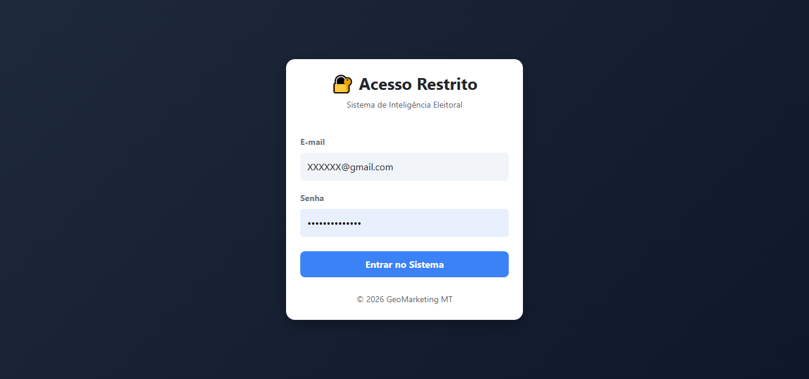
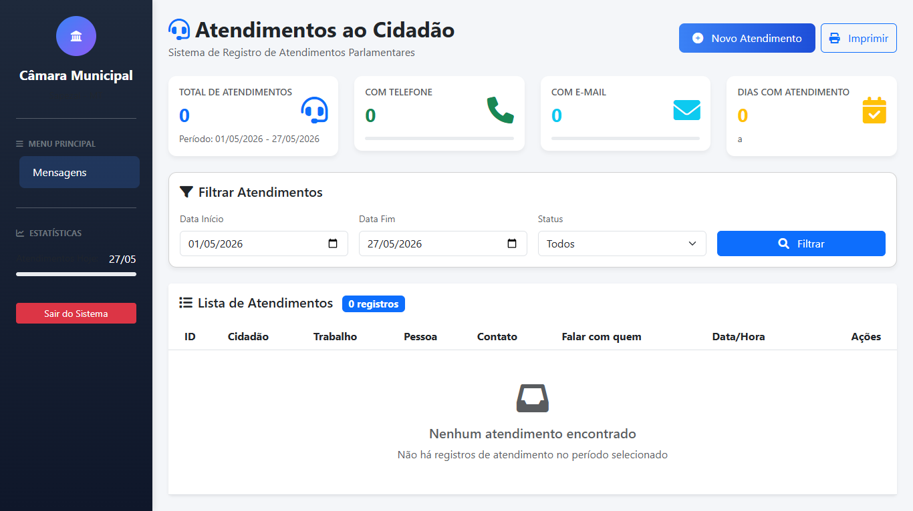
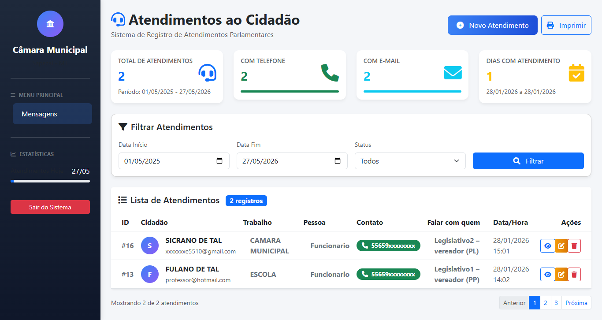
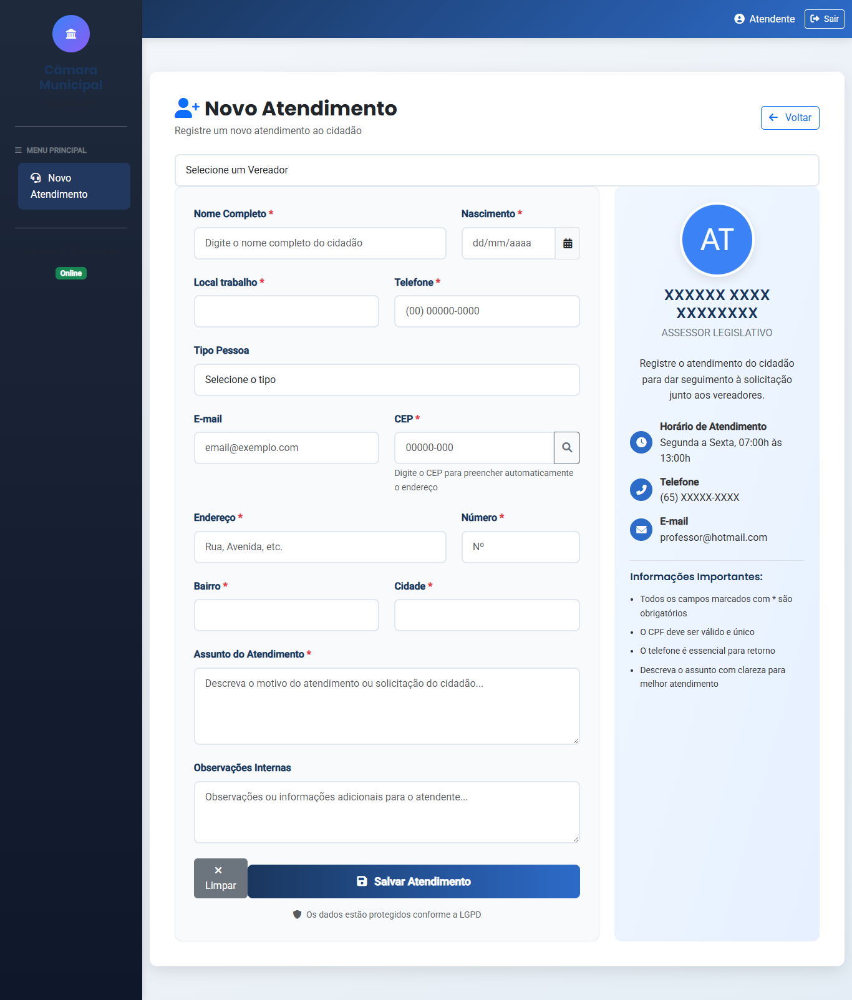
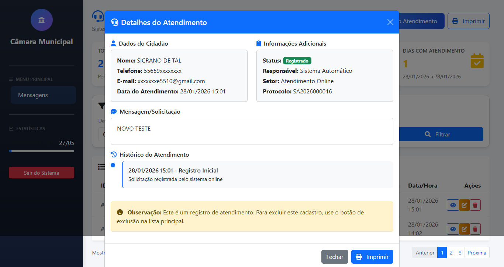
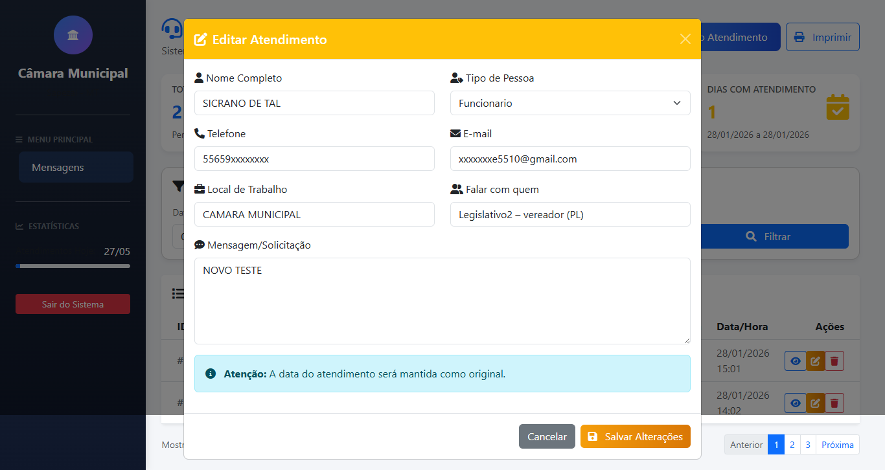
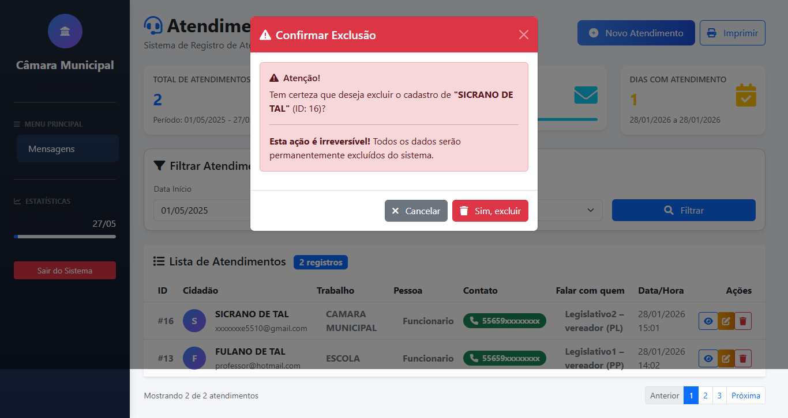
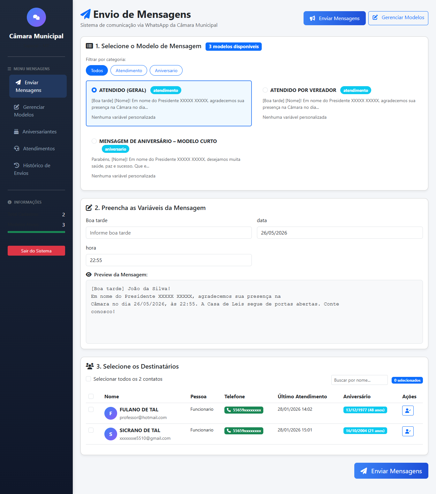
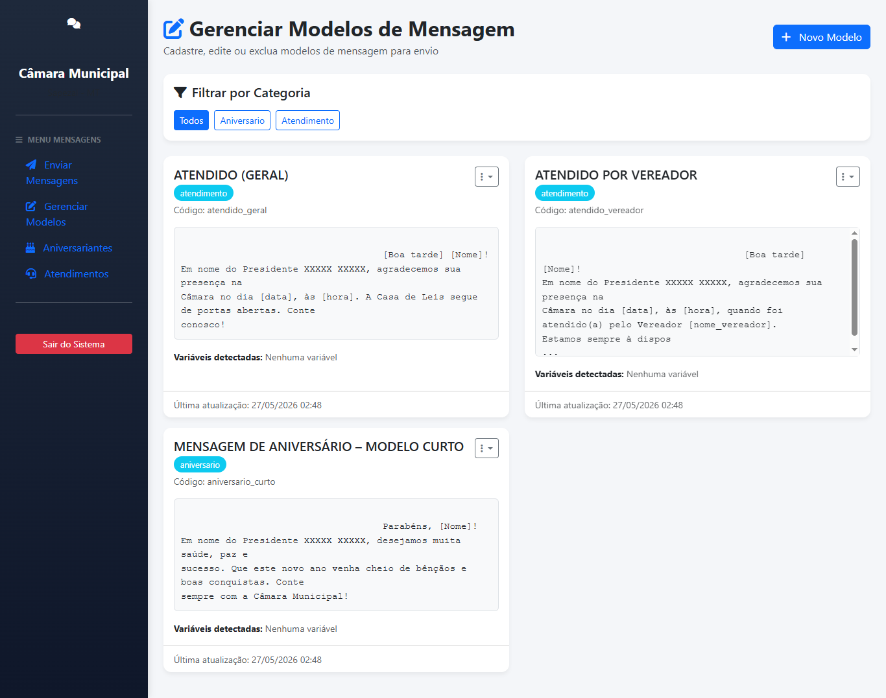
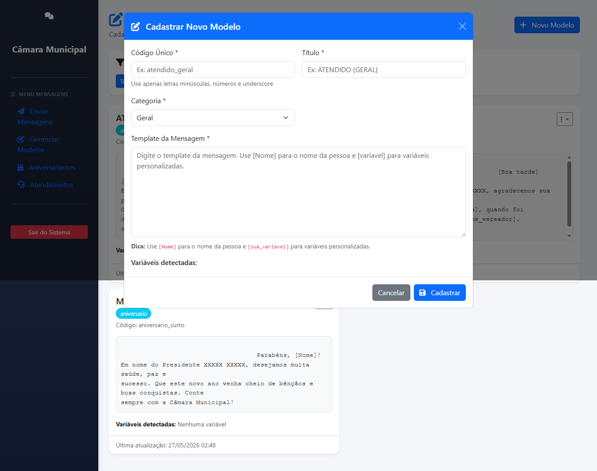

# 🏛️ Sistema de Atendimento Parlamentar e Gestão de Comunicação

[](LICENSE)
[](https://php.net)
[](https://mariadb.org)
[](https://getbootstrap.com)

## 📋 Sobre o Projeto

Este sistema foi desenvolvido para modernizar e humanizar o atendimento nas Câmaras Municipais, substituindo o gerenciamento por planilhas por uma solução integrada, ágil e transparente.

A realidade da maioria das casas legislativas ainda é o atendimento informatizado incipiente, onde assessores parlamentares perdem tempo com tarefas manuais. Este projeto resolve esse problema ao automatizar a comunicação com o cidadão, desde o registro da visita até o envio de agradecimentos e informativos segmentados.

### ✨ Principais Funcionalidades

- **Registro Rápido de Atendimentos:** Cadastro intuitivo de cidadãos e suas solicitações.
- **Automação de Comunicação:** Disparo automático de mensagens de agradecimento via WhatsApp (API integrada) assim que o atendimento é registrado.
- **Fluxo Inteligente:** A solicitação é automaticamente direcionada ao assessor do vereador correspondente, otimizando o encaminhamento.
- **Histórico Completo:** Armazenamento de todo o histórico de atendimentos por parlamentar.
- **Gestão Dinâmica de Modelos:** Criação e edição de templates de mensagens (ex: aniversários, sessões extraordinárias).
- **Segmentação de Envio:** Possibilidade de enviar comunicados específicos para grupos de cidadãos.
- **Interface Moderna:** Desenvolvida com Bootstrap e Tailwind para ser intuitiva e responsiva.

---

## 🖼️ Telas do Sistema (Fluxo Completo)

A seguir, um tour visual pela interface, demonstrando a jornada do usuário.

### 1. Tela de Login (Acesso Restrito)
Acesso seguro ao sistema com autenticação por e-mail e senha.

*Sistema de autenticação para garantir que apenas usuários autorizados acessem os dados.*

### 2. Dashboard Inicial (Atendimentos ao Cidadão)
Visão geral com indicadores-chave (total de atendimentos, contatos registrados) e período de análise.

*Painel de controle com cards de estatísticas para uma gestão rápida e eficiente.*

### 3. Lista de Atendimentos com Filtros
Visualização tabular de todos os registros, permitindo filtros por data e status.

*Facilidade na busca e organização dos atendimentos realizados.*

### 4. Novo Atendimento (Formulário Completo)
Registro detalhado do cidadão, endereço, contato e, principalmente, o **assunto** que será encaminhado ao assessor.

*Campos essenciais para capturar todas as informações necessárias para um atendimento assertivo.*

### 5. Detalhes do Atendimento
Visualização completa de um atendimento específico, incluindo protocolo, histórico e observações.

*Histórico completo e rastreável de cada interação com o cidadão.*

### 6. Edição de Atendimento
Permite corrigir ou atualizar informações do registro, mantendo a data original.

*Flexibilidade para ajustar dados sem perder a rastreabilidade temporal.*

### 7. Exclusão de Atendimento (Com Confirmação)
Ação segura com aviso de irreversibilidade para evitar exclusões acidentais.

*Segurança e prevenção contra perda de dados importantes.*

### 8. Envio de Mensagens (Módulo de Comunicação)
Integração com WhatsApp. Etapas:
1.  Seleção do modelo de mensagem.
2.  Preenchimento de variáveis (ex: `[Nome]`, `[data]`).
3.  Seleção dos destinatários.

*Automação do contato com o cidadão, agilizando o pós-atendimento.*

### 9. Gerenciamento de Modelos de Mensagem
Lista de templates pré-cadastrados (ex: "Atendido Geral", "Mensagem de Aniversário"), com opção de filtrar por categoria.

*Central de templates para padronizar e agilizar as comunicações.*

### 10. Cadastro de Novo Modelo
Interface para criar novos templates utilizando placeholders como `[Nome]` e variáveis personalizadas.

*Personalize as mensagens para diferentes cenários (aniversários, sessões, agendas).*

---

## 🚀 Tecnologias Utilizadas

- **Backend:** PHP 8.4 (com programação orientada a objetos e boas práticas).
- **Servidor Web:** Nginx (alto desempenho e baixo consumo de recursos).
- **Banco de Dados:** MariaDB (confiável e compatível com MySQL, ideal para dados relacionais).
- **Frontend:**
  - **Bootstrap** (última versão) - para componentes responsivos.
  - **Tailwind CSS** (última versão) - para estilização customizada e utilitária.
- **Integração Externa:** API oficial do WhatsApp para envio automatizado de mensagens.

---

## 🧠 Lógica de Negócio e Diferenciais

- **Atendimento Automatizado:** Ao cadastrar um cidadão, o sistema dispara **imediatamente** um WhatsApp de agradecimento pela visita.
- **Fluxo Inteligente:** O registro é direcionado em tempo real ao **assessor do vereador** correto, que visualiza o assunto e dá o devido encaminhamento.
- **Atendimento Posterior:** Após a tratativa com o vereador, o assessor utiliza o sistema para enviar um segundo agradecimento (em nome do vereador e do presidente) e anexar a solução ou retorno ao histórico.
- **Comunicação Segmentada:** Com base nos dados, é possível enviar comunicados automáticos e segmentados, como:
  - Mensagens de aniversário.
  - Alertas sobre sessões extraordinárias.
  - Informativos gerais da Câmara.

---

## 📂 Estrutura de Código (Sugerida)

Caso você queira exibir também a estrutura de diretórios (recomendado para projetos no GitHub), pode incluir algo como:

```bash
├── app/
│   ├── Controllers/       # Lógica de controle (ex: AtendimentoController)
│   ├── Models/            # Interação com o banco de dados (Eloquent ou PDO)
│   ├── Views/             # Templates (Blade ou PHP puro)
│   └── Services/          # Integrações (API WhatsApp, envio de e-mails)
├── public/
│   ├── css/               # Estilos (Bootstrap, Tailwind, customizados)
│   ├── js/                # Scripts frontend
│   └── index.php          # Ponto de entrada da aplicação
├── routes/                # Definição de rotas (web.php, api.php)
├── database/              # Migrations e seeders do MariaDB
├── docs/                  # Imagens da documentação (as que usei acima)
├── .env                   # Configurações sensíveis (chave da API, credenciais)
├── composer.json          # Dependências PHP
└── README.md              # Este arquivo
